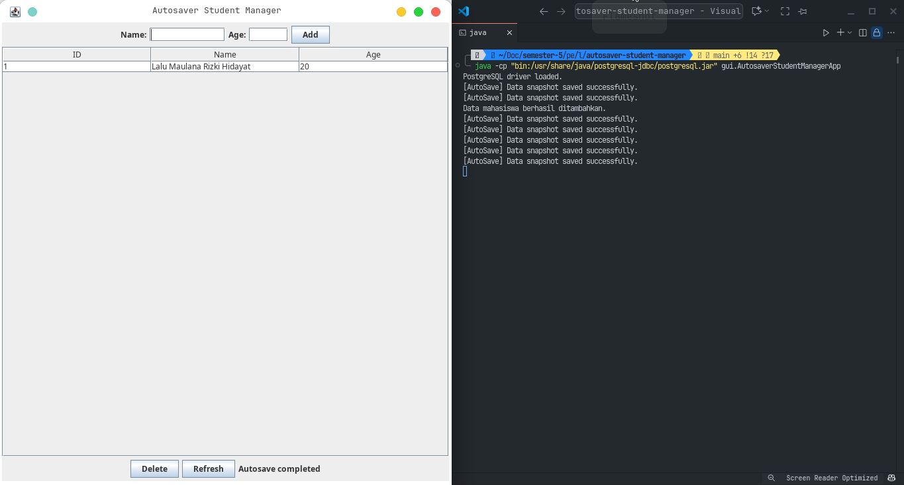

# Autosaver Student Manager

## Deskripsi

**Autosaver Student Manager** adalah aplikasi desktop sederhana berbasis Java Swing yang berfungsi untuk mengelola data mahasiswa. Aplikasi ini memungkinkan pengguna untuk menambah, melihat, dan menghapus data mahasiswa yang disimpan dalam database PostgreSQL.

Fitur utama dari aplikasi ini adalah adanya mekanisme "auto-save" yang berjalan di *background thread*. Fitur ini secara berkala memberikan notifikasi bahwa data sedang disimpan, meskipun pada implementasi saat ini hanya berupa simulasi tanpa melakukan operasi penyimpanan data secara nyata ke database.

Aplikasi ini dibangun dengan mengikuti pola desain Model-View-Controller (MVC) sederhana, di mana:
- **Model**: Merepresentasikan data (entitas `Student` dan `Person`).
- **View**: Merupakan antarmuka pengguna (GUI) yang dibuat dengan Java Swing (`AutosaverStudentManagerApp`).
- **Controller**: Logika bisnis dan interaksi dengan database ditangani oleh kelas DAO (`StudentDAO`).

## Struktur Proyek

Proyek ini diorganisir ke dalam beberapa package sesuai dengan fungsinya:

```
src/
├── dao/
│   ├── DBUtil.java        # Utilitas untuk koneksi ke database PostgreSQL.
│   └── StudentDAO.java    # Data Access Object untuk operasi CRUD pada data mahasiswa.
├── gui/
│   └── AutosaverStudentManagerApp.java # Kelas utama yang membangun GUI dan menangani event.
└── model/
    ├── Person.java        # Kelas abstrak sebagai dasar untuk entitas dengan ID dan nama.
    └── Student.java       # Model data yang merepresentasikan seorang mahasiswa.
```

## Detail Komponen

### 1. Paket `model`

- **`Person.java`**: Kelas abstrak yang memiliki properti dasar `id` dan `name`. Kelas ini menjadi superclass untuk model lain yang memiliki atribut serupa.
- **`Student.java`**: Kelas yang mewarisi `Person` dan menambahkan properti `age`. Kelas ini merepresentasikan data utama yang dikelola oleh aplikasi.

### 2. Paket `dao`

- **`DBUtil.java`**:
    - Mengelola koneksi ke database PostgreSQL.
    - Konfigurasi koneksi (URL, user, password) didefinisikan di sini.
    - Menggunakan `DriverManager` untuk membuat koneksi dan `Class.forName` untuk memastikan driver JDBC PostgreSQL telah ter-load.
    - Menampilkan pesan error jika koneksi atau driver gagal dimuat.

- **`StudentDAO.java`**:
    - Bertanggung jawab untuk semua operasi *Create, Read, Delete* (CRUD) pada tabel `students` di database.
    - `getAll()`: Mengambil semua data mahasiswa dari database dan mengembalikannya sebagai `List<Student>`.
    - `insert(Student s)`: Menambahkan data mahasiswa baru ke database.
    - `delete(int id)`: Menghapus data mahasiswa berdasarkan `id`.

### 3. Paket `gui`

- **`AutosaverStudentManagerApp.java`**:
    - Merupakan kelas utama (`main class`) yang menjalankan aplikasi.
    - Membangun antarmuka pengguna (GUI) menggunakan komponen Java Swing seperti `JFrame`, `JTable`, `JTextField`, dan `JButton`.
    - Menampilkan data mahasiswa dalam sebuah tabel (`JTable`).
    - Menyediakan form untuk menambah data (nama dan umur) dan tombol untuk menghapus data yang dipilih dari tabel.
    - **Fitur Auto-Save**:
        - Menggunakan `ScheduledExecutorService` untuk menjalankan tugas secara periodik di *background thread*.
        - Setiap 15 detik, status bar di bagian bawah akan menampilkan pesan "Auto-saving data..." untuk mensimulasikan proses penyimpanan.
        - Ini adalah contoh sederhana dari implementasi *multithreading* di aplikasi GUI untuk tugas yang berjalan di latar belakang tanpa memblokir *Event Dispatch Thread* (EDT).

## Prasyarat

1.  **Java Development Kit (JDK)**: Pastikan JDK versi 8 atau lebih baru telah terinstal.
2.  **PostgreSQL**: Database PostgreSQL harus terinstal dan berjalan.
3.  **Driver JDBC PostgreSQL**: Library atau driver JDBC untuk PostgreSQL harus ada di dalam classpath proyek.
4.  **Konfigurasi Database**:
    - Buat sebuah database dengan nama `belajar`.
    - Buat tabel `students` di dalam database tersebut dengan struktur berikut:
      ```sql
      CREATE TABLE students (
          id SERIAL PRIMARY KEY,
          name VARCHAR(255) NOT NULL,
          age INT
      );
      ```
    - Sesuaikan konfigurasi koneksi (URL, user, dan password) di dalam file `src/dao/DBUtil.java` jika diperlukan.

## Cara Menjalankan Aplikasi

1.  **Kompilasi**:
    Kompilasi semua file `.java` dari direktori `src`.
    ```zsh
    javac -cp "/usr/share/java/postgresql-jdbc/postgresql.jar" -d bin src/model/*.java src/dao/*.java src/gui/*.java
    ```

    ```zsh
    # Navigasi ke direktori utama proyek
    javac -d out -cp "path/to/postgresql-driver.jar" src/dao/*.java src/model/*.java src/gui/*.java
    ```

2.  **Jalankan**:
    Jalankan kelas utama `AutosaverStudentManagerApp` dari direktori output.
    ```zsh
    java -cp "bin:/usr/share/java/postgresql-jdbc/postgresql.jar" gui.StudentManagerApp
    ```

Setelah dijalankan, jendela aplikasi akan muncul, dan Anda dapat mulai mengelola data mahasiswa.

Hasil Screenshot 1



Hasil screenshot 2

